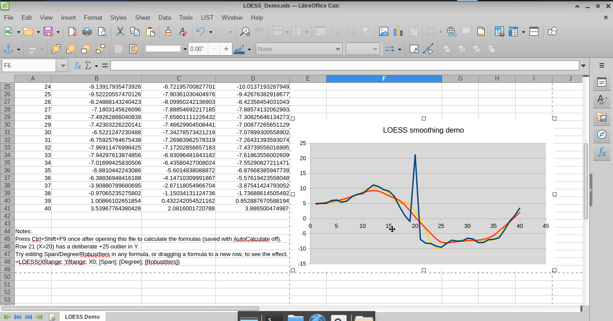

# Calc LOESS/LOWESS Add-in

A LOESS/LOWESS (locally weighted polynomial regression) smoothing function for
LibreOffice Calc, available two ways:

- as a **pure StarBasic macro** (`src/LOESS.bas`, the original objective - no
  Python, no external libraries, no compiler), or
- as a **real Python UNO Add-In** (`src/loess_impl.py`), which additionally
  gets `LOESS` listed in the Function Wizard and formula autocomplete - not
  achievable from a Basic macro alone.

See **Installation** below for the tradeoff between the two.

## What it does

`LOESS()` fits a local polynomial (constant, linear, or quadratic) around each
requested x-value, weighted by a tricube kernel over the nearest neighbours,
optionally refined with Cleveland-style robustness iterations that down-weight
outliers. This is the same family of algorithm as R's `lowess()`/`loess()`.

## Installation

There are **two** ways to install `LOESS()`, trading off a dependency on
Python against a nicer editing experience:

|                              | `install.sh` (Basic macro) | `build_addin.sh` (Python Add-In) |
|------------------------------|----------------------------|-----------------------------------|
| Dependencies                 | None - pure StarBasic      | LibreOffice **SDK** (`unoidl-write`) + Python |
| `=LOESS(...)` as a formula   | ✅                          | ✅ |
| Function Wizard / autocomplete | ❌ (see explanation below) | ✅ |

### Option A: Basic macro (`install.sh`, no Python)

Run `./install.sh`. It copies `src/LOESS.bas` and `src/SelfTest.bas` into your
personal LibreOffice **Standard** Basic library
(`~/.config/libreoffice/4/user/basic/Standard`) as two new modules
(`LOESSAddin`, `LOESSSelfTest`), backing up your existing Standard library
first. LibreOffice must be fully closed while it runs. Re-run it any time to
pick up changes to `src/LOESS.bas` - it's additive and idempotent, so it never
touches your own existing macros.

Why not a `.oxt` extension installed through the Extension Manager? That was
the first approach here, but it turned out to be a dead end worth recording:
**Calc's formula compiler only resolves a bare `=FUNCTION(...)` name against
your personal "Standard" library.** A Basic library shipped inside an
extension - regardless of what you name it, even "Standard" itself - gets
installed, shows up in the Extension Manager, and can be run as a macro, but
is never searched when compiling a cell formula, so `=LOESS(...)` fails with
`#NAME?` no matter what. This was verified directly (not assumed): the exact
same code resolves correctly the moment it's placed in the personal Standard
library, and fails every time it's shipped via `.oxt`, independent of the
library's name. (That dead-end `.oxt`-wrapped-Basic version was tried and
removed from this repo once the real Add-In below existed.)

Once installed, run **Tools > Macros > Run Macro... > My Macros > Standard >
LOESSSelfTest > RunSelfTest** to sanity check it - it opens a scratch
spreadsheet, runs a few checks with analytically known answers, and reports
PASS/FAIL in a dialog.

A plain Basic macro used as a cell formula is resolved by name only at
calculation time - Calc never knows its argument count or types in advance,
so **it can never appear in the Function Wizard or in formula autocomplete**
(those are driven by a separate registry that only real, registered UNO
Add-Ins are enumerated into). This isn't a bug or a missing setting; it's a
hard architectural split between "a macro that happens to be callable from a
formula" and "a registered spreadsheet function" - hence Option B.

### Option B: Python Add-In (`build_addin.sh`, gets autocomplete)

A real UNO Add-In (`com.sun.star.sheet.AddIn`) *is* enumerated into that
registry, so `LOESS` shows up in the Function Wizard (category "Add-In") and
autocompletes as you type - but a genuine Add-In needs a compiled/scripted
component. `src/loess_impl.py` is a faithful line-by-line Python port of
`src/LOESS.bas` (same algorithm, same defaults, same tested numerical
behaviour), exposed via the interface in `idl/com/example/loess/XLoess.idl`.

Requires the LibreOffice **SDK** (for `unoidl-write`, which compiles the IDL
interface into a UNO type library - no C++/Java compiler needed, just the SDK
tool). Check `<LibreOffice install dir>/sdk/bin/unoidl-write` exists; on this
machine that's `/usr/lib64/libreoffice/sdk/bin/unoidl-write`.

```sh
./build_addin.sh                                    # -> build/CalcLoessAddin.oxt
unopkg add --force build/CalcLoessAddin.oxt         # install
```

Restart LibreOffice, then `=LOESS(...)` autocompletes and shows full argument
help in the Function Wizard. If `install.sh`'s Basic macro is *also*
installed, Calc resolves the bare `LOESS` name to the Add-In (verified
directly: the Add-In's fully-qualified internal name shows up in
`getFormula()` rather than the plain Basic-macro form) - so it's safe to have
both, though Option B alone is enough once the SDK is available.

Remove with `unopkg remove com.example.loess`.

## Usage

```
=LOESS(XRange; YRange; X0; [Span]; [Degree]; [RobustIters])
```

| Argument      | Meaning                                                                                                                                                                                    |
|---------------|---------------------------------------------------------------------------------------------------------------------------------------------------------------------------------------|
| `XRange`      | Range (or single cell) of sample x-values.                                                                                                                                              |
| `YRange`      | Range (or single cell) of sample y-values, same shape as `XRange`.                                                                                                                      |
| `X0`          | The x-value at which to evaluate the smoothed curve. Drag the formula across/down to build a smoothed series, the same way `TREND()` is used.                                          |
| `Span`        | Fraction of the data used in each local fit. `0 < Span <= 1` selects the nearest `Span*N` points (a k-nearest-neighbour window). `Span > 1` uses all points with a widened bandwidth. Default `0.6667` (2/3, the classic LOWESS default). |
| `Degree`      | Degree of the local polynomial: `0` (local weighted mean), `1` (local linear, default), or `2` (local quadratic).                                                                       |
| `RobustIters` | Number of Cleveland-style robustness (bisquare) iterations that down-weight outliers. Default `0` (fast, single pass). Classic LOWESS uses `3`. See **Performance** below.              |

Example - smoothing a noisy series in column A (x) / B (y), evaluated at the
x-value in D2, dragged down:

```
=LOESS($A$1:$A$100; $B$1:$B$100; D2; 0.3; 1; 0)
```

Blank or non-numeric cells are handled safely: a pair is only used if *both*
the x and y cell at that position are numeric, so a gap on one side can never
shift the two ranges out of alignment.

See [`examples/LOESS_Demo.ods`](examples/LOESS_Demo.ods) for a worked example:
sample noisy data with a deliberate outlier, `LOESS()` dragged down two
columns (degree 1 and 2), a robust-vs-non-robust comparison at the outlier,
and a chart.



## Performance

`RobustIters > 0` is O(n²) per formula evaluation, because deriving the
robustness weights requires fitting a local regression at *every* sample
point, not just at `X0`. If you drag a `RobustIters > 0` formula down a
column, each cell redundantly redoes this O(n²) work (Calc has no way to
share it across cells). For a few dozen to a couple hundred points this is
unnoticeable; for large datasets dragged across many cells, prefer
`RobustIters = 0`, or precompute the smoothed series once and paste it as
values.

## Algorithm

- **Neighbourhood weights**: tricube kernel `(1 - u^3)^3` on the distance to
  `X0`, scaled by a bandwidth taken from the `Span*N`-th nearest neighbour
  (or the full data range, scaled by `Span`, when `Span > 1`).
- **Local fit**: the weighted polynomial (degree 0/1/2) is fit in coordinates
  centred on `X0`, so its intercept *is* the smoothed value - solved via
  Gaussian elimination with partial pivoting on the small normal-equations
  system.
- **Robustness**: when `RobustIters > 0`, residuals from an initial fit at
  every sample point feed a bisquare re-weighting (scaled by 6x the median
  absolute residual), repeated `RobustIters` times, following Cleveland
  (1979), *"Robust Locally Weighted Regression and Smoothing Scatterplots"*,
  JASA 74(368): 829-836.

## Repository layout

```
src/LOESS.bas       The Basic add-in: the LOESS() function and its helpers.
src/SelfTest.bas    Interactive self-test (Tools > Macros > Run Macro > RunSelfTest).
install.sh          Installs src/*.bas into your personal Standard library (Option A).
examples/LOESS_Demo.ods
                    Sample workbook - see Usage above.
idl/com/example/loess/XLoess.idl
                    UNO interface for the Python Add-In (Option B).
src/loess_impl.py   Python port of LOESS.bas implementing that interface.
registration/       CalcAddIns.xcu / manifest.xml / description.xml for the Add-In package.
build_addin.sh      Compiles the IDL and packages build/CalcLoessAddin.oxt (Option B).
tools/test_addin.py End-to-end test of the Python Add-In against a headless LibreOffice.
```

## Testing notes

The algorithm was cross-checked against an independent NumPy reference
implementation of the same tricube/robustness algorithm across a range of
`Span`/`Degree`/`RobustIters` combinations, boundary and extrapolation
points, exact linear/quadratic data (degree-matched fits reproduce the data
exactly), misaligned blank cells, single-cell inputs, and invalid-input error
handling - all matching to at least 8 significant digits where an analytic or
independently-computed answer was available.
